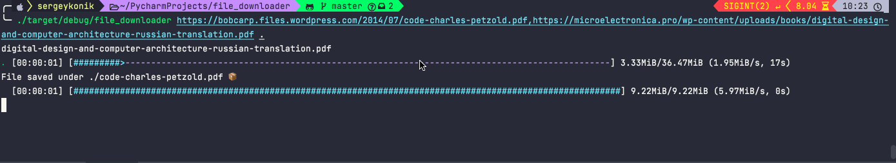

# rust-downloder
CLI program to download files from specified url. Rust learning purpose

## Usage

`$ cargo run https://www.softcover.io/download/88e295ad/GoBootcamp/ebooks/GoBootcamp.pdf "${PWD}/go-book.pdf"`

As a result content of the page will be saved under `go-book.pdf`.

